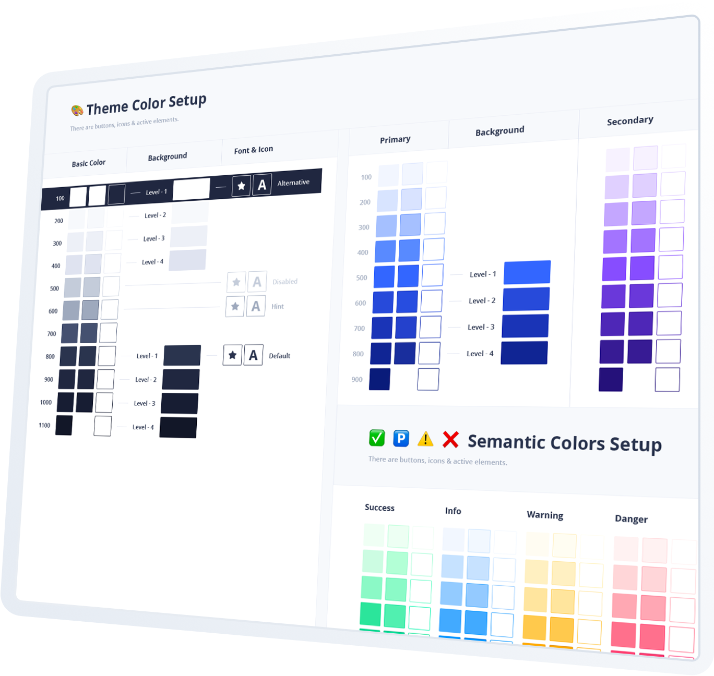
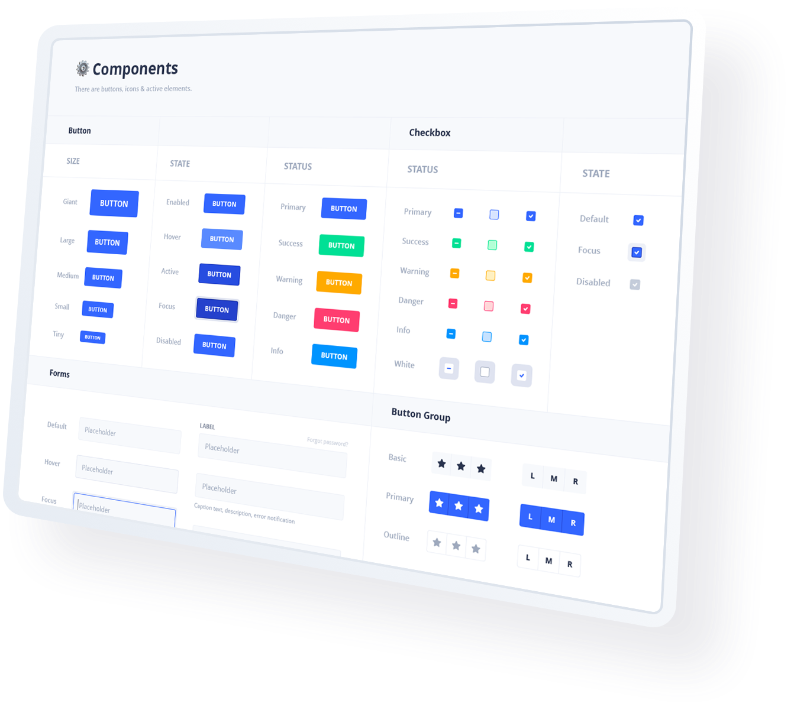

# What is OAH UI?

OAH UI is a set of essential modules for your next React application.

The purpose of the modules is to solve generic tasks faster and more efficient so that you can focus on business logic and leave routine behind.

## What's included

OAH UI `npm` package contain three things:

- OAH UI Theme `oah-ui/theme`
  - Theme System - set of `javaScript` object, which allows you to modify application look & feel by changing variables, with fewer custom styles.
  - Responsive breakpoints - have function to use in your `Styled Components` breakpointUp breakpointDown breakpointBetween breakpointOnly.
  - Server-side rendering compatibility!
  - Right-to-left writing system support for all components.
- OAH UI Components `oah-ui`
  - Global components (Layout-Card-FlipCard-RevealCard-Accordion-List).
  - Navigation components (Sidebar-Menu-Tabs-Actions).
  - Forms components (InputGroup-Radio-Select-Checkbox-Button).
  - Grid components (Container-Row-Col).
  - Modals & Overlays components (Popover-Toastr-Tooltip-ContextMenu).
  - Extra components (Search-User-Badge-Alert-ProgressBar-ChatUI-Spinner).
- OAH UI Svg `oah-ui/svg`
  - This svg components ready to use.
- Admin dashboard starter kit [oah-admin](https://github.com/AhmedElywa/oah-admin) - Admin dashboard template based on Gatsby with oah-ui component package.

## The purpose

There are a lot of awesome front-end frameworks out there these days.
They provide a massive quantity of useful features making our lives more comfortable.
Our intention is not to create a new one as we are pretty much aware of the complexity and amount of work developers put on their creations.
But as developers, we feel that nowadays front-end development is disjointed.
You have to search for libraries, go through the different installation process, everything looks different, and sometimes it's just annoying that you can't just sit and start going.
That's why we are on a mission to assemble together the most useful modules and libraries, join them with a unified application and graphical interface creating a great toolkit for easier setup.

## Assumptions

This documentation assumes that you are already familiar with JavaScript, React, CSS and Bootstrap.

## Have questions?

Didn't find something here? Look through the [issues](https://github.com/AhmedElywa/oah-ui/issues) or simply drop us a line at <ahmed.elywa@icloud.com>.
